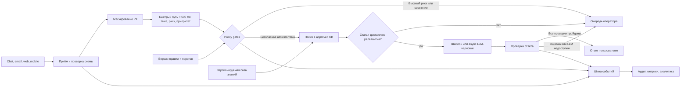

# Архитектура

## Основной поток

## Синхронный и асинхронный контуры

Пользовательский тикет нужно принять и направить быстро, поэтому в синхронном контуре остаются только проверка входа, PII masking, классификация риска и выбор очереди. Целевой бюджет p95 — 500 мс: 50 мс на приём, 80 мс на redaction, 150 мс на классификацию, 70 мс на policy/routing и 150 мс резерва.

Поиск, генерация черновика и дополнительные проверки могут идти асинхронно. Если они задержались, тикет уже сохранён и назначен — пользовательский запрос не потерян.

## Компоненты целевой системы

- **Ingress:** приводит разные каналы к единой схеме и не создаёт дубли по `ticket_id`.
- **Fast classifier:** локально определяет тему, риск и очередь.
- **Policy engine:** решает, разрешена ли автоматизация; LLM не может отменить его запрет.
- **Retrieval:** ищет только в утверждённых и актуальных статьях.
- **Draft worker:** формирует ответ по статье; в PoC это шаблон, в целевой системе возможен LLM.
- **Support CRM:** получает очередь, подсказку и итоговое действие; возвращает решение оператора и reopen/CSAT.
- **Внешний LLM API:** вызывается только из асинхронного draft worker и получает уже очищенный контекст.
- **Audit:** хранит решение, причины, scores, идентификатор и версию статьи, а также версии модели и policy без исходного текста.

Raw-текст с PII хранится отдельно, шифруется и имеет короткий срок жизни. Для ML/LLM используется redacted event. База знаний и правила версионируются, чтобы любое решение можно было воспроизвести.

## Высокая нагрузка и резервные сценарии

Очередь событий сглаживает инцидентные пики; тикеты делятся по `ticket_id`, а incident/high-risk получают больший приоритет. Повторная доставка безопасна благодаря идемпотентности. После ограниченного числа повторов ошибка уходит в DLQ и поднимает алерт.

При недоступности LLM circuit breaker отключает генерацию, но классификация и маршрутизация продолжают работать. Payment, account takeover, legal/security, обнаруженный PII, prompt injection, слабый retrieval и низкая уверенность в PoC всегда означают `ESCALATE`.

## Что есть в PoC

Реализован только вертикальный срез `CLI → redaction → classification/risk → retrieval → policy → response/escalation → audit`. Очередь, CRM, vector DB, обученная модель и LLM — целевой дизайн, а не скрытая часть прототипа.

